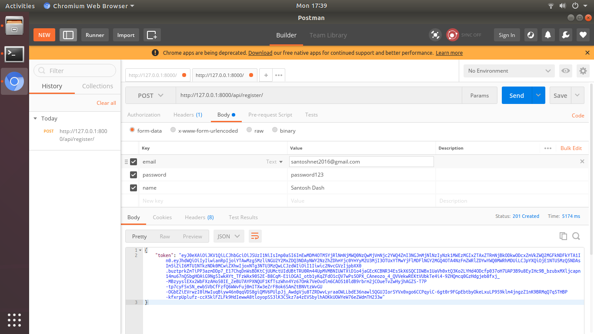
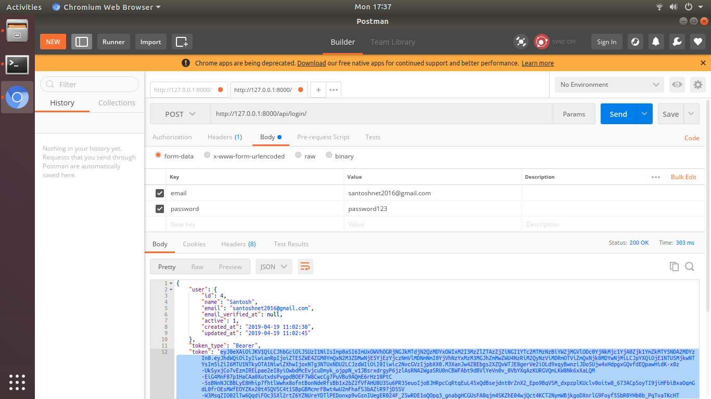
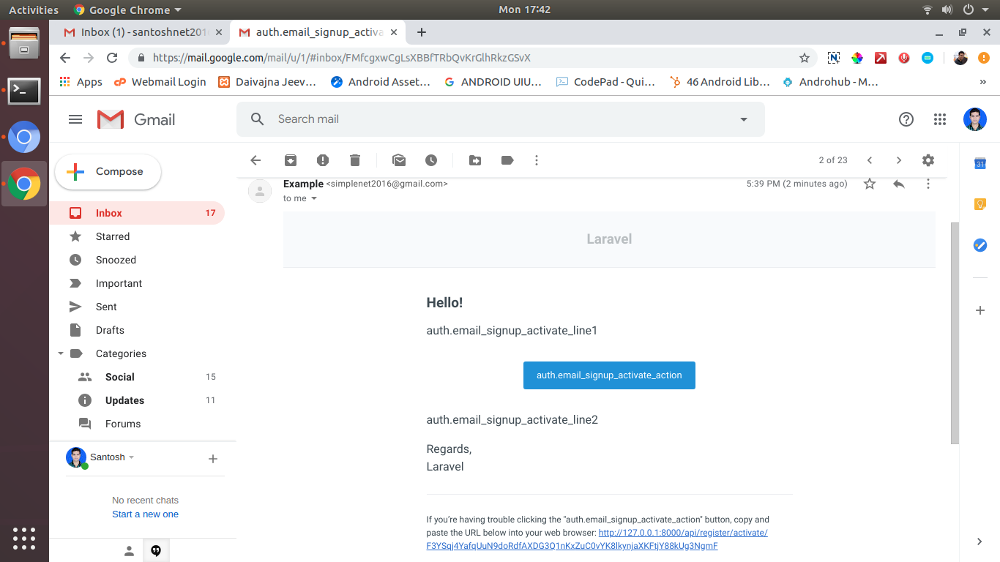
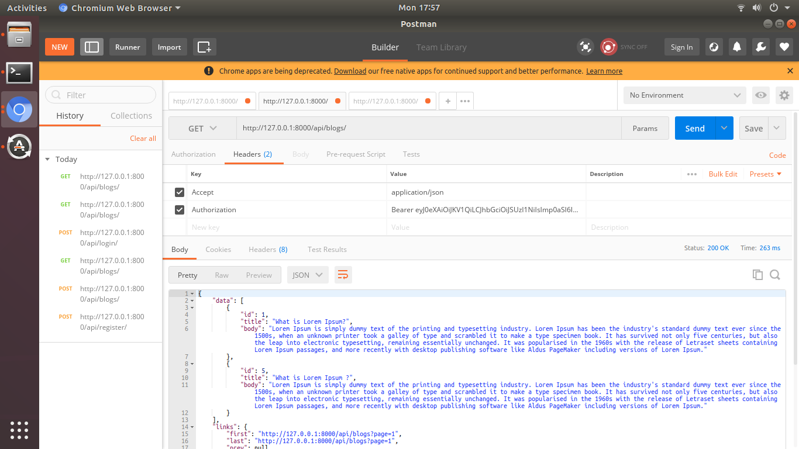
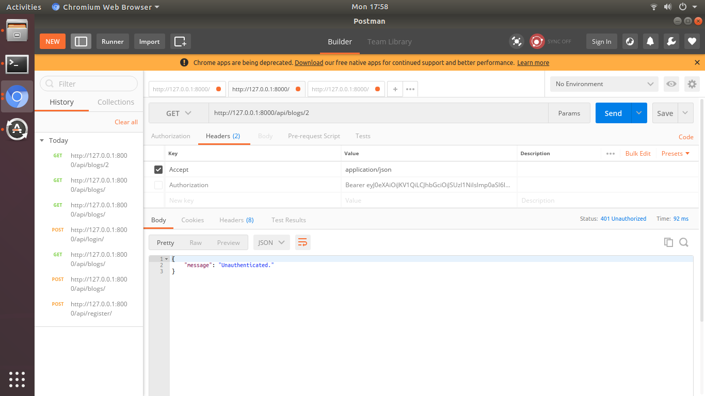
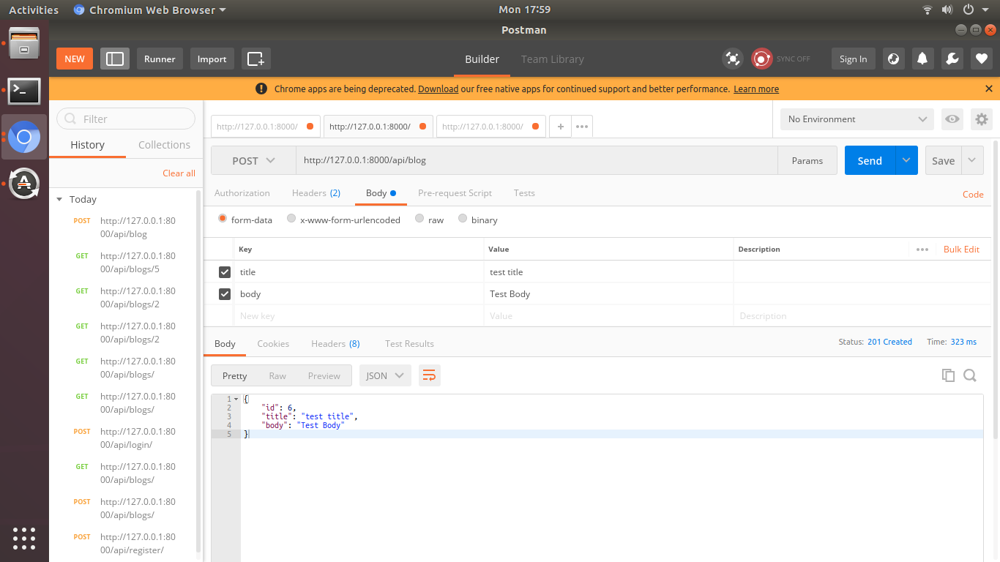
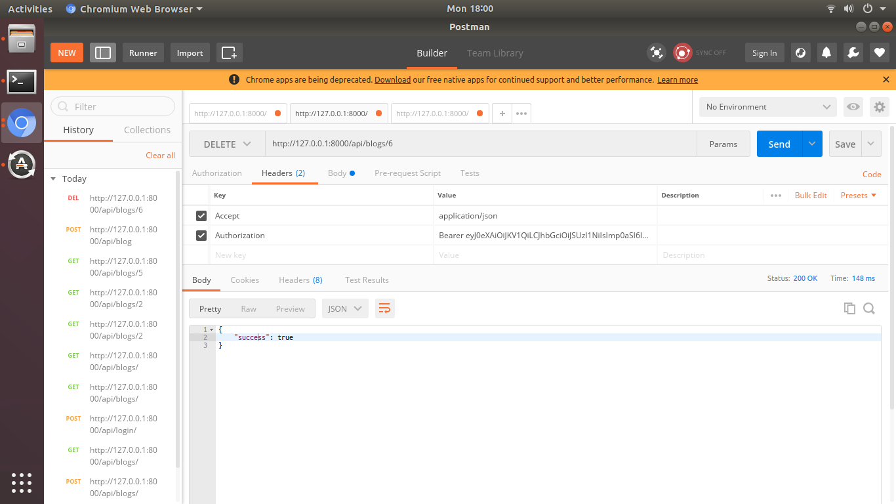

<p align="center"></p>

<p align="center">
<a href="https://travis-ci.org/laravel/framework"></a>
<a href="https://packagist.org/packages/laravel/framework"></a>
<a href="https://packagist.org/packages/laravel/framework"></a>
<a href="https://packagist.org/packages/laravel/framework"></a>
</p>

## About Laravel-api


## Table of Contents

- [Installation](#installation)
- [Routes](#routes)
    - [Apientication](#Apientication)
    - [Password Reset](#password-reset)


### Installation

1. Clone repository
```
$ git clone https://github.com/santoshnet/laravel-api.git
```

2. Enter folder
```
$ cd laravel-api
```

3. Install composer dependencies
```
~/laravel-api$ composer install
```

4. Generate APP_KEY
```
~/laravel-api$ php artisan key:generate
```

5. Configure .env file, edit file with next command `$ nano .env`
```
DB_CONNECTION=mysql
DB_HOST=127.0.0.1
DB_PORT=3306
DB_DATABASE=database
DB_USERNAME=user
DB_PASSWORD=secret
```

MAIL_DRIVER=smtp
MAIL_HOST=smtp.gmail.com
MAIL_PORT=587
MAIL_USERNAME=mymail@gmail.com
MAIL_PASSWORD=secret
MAIL_ENCRYPTION=TLS


6. Run migrations
```
~/laravel-api$ php artisan migrate
```

7. Create client
```
~/laravel-api$ php artisan passport:install
```


### Routes

##### Apientication

- POST /Api/login
- GET /Api/logout
- POST /Api/register
- GET /Api/register/activate/{token}
- GET /Api/user_details


##### Password Reset

- POST /password/create
- GET /password/find/{token}
- POST /password/reset

##### Blog Api

- POST /blog/
- GET /blogs/
- POST /blogs/{id}
- GET /blogs/{id}
- DELETE /blogs/{id}

##### Screenshot











## License

The Laravel framework is open-source software licensed under the [MIT license](https://opensource.org/licenses/MIT).
